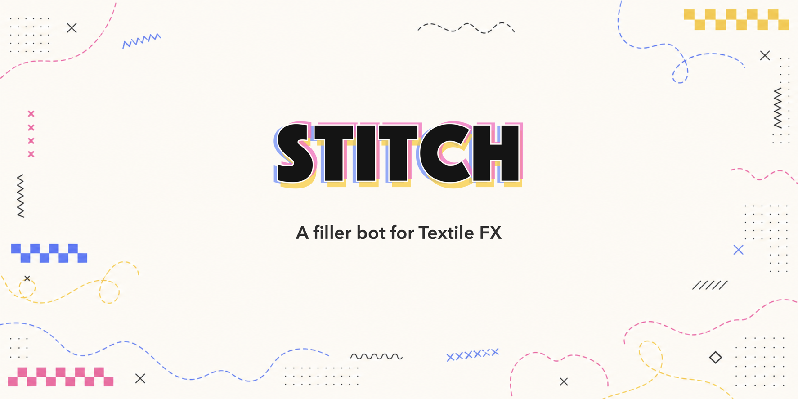

# Stitch

Stitch is the Textile operator bot for filler-network market making and
settlement closing. It runs as a single binary named `stitch`.

Stitch can do two jobs:

- **Market making**: keep live buy and sell quotes for a configured
  soft-asset/stablecoin pair.
- **Settlement closing**: close eligible settlement auction positions on-chain
  when the configured margin rules are met.

You can run either job by itself, or both jobs together for the same pool.

## Quick Start

Install the latest release:

```bash
curl --proto '=https' --tlsv1.2 -LsSf \
  https://github.com/textile-protocol/textile-stitch/releases/latest/download/stitch-installer.sh | sh
```

Make sure the install directory is on your `PATH`, then check the binary:

```bash
stitch --version
```

Create a config file:

```bash
curl -L -o stitch.toml \
  https://raw.githubusercontent.com/textile-protocol/textile-stitch/main/stitch.example.toml
```

Set the operator wallet key in the environment. Do not put the private key in
`stitch.toml`.

```bash
export STITCH_PRIVATE_KEY=0x...
```

Run once in dry-run mode before posting live orders:

```bash
stitch --config stitch.toml --dry-run
```

Run live:

```bash
stitch --config stitch.toml
```

For troubleshooting and operational checks, see [DEBUGGING.md](DEBUGGING.md).

## How It Works

Stitch reads `stitch.toml`, polls your configured price feed, signs UniswapX
limit orders, and posts those signed orders to the Textile indexer. The wallet
private key is read from `STITCH_PRIVATE_KEY`.

For market making, each configured pool can have:

- a **buy side**, where Stitch spends the stable/debt asset to buy the
  soft/collateral asset below the feed price;
- a **sell side**, where Stitch spends the soft/collateral asset to sell above
  the feed price.

For settlement closing, Stitch can also discover open positions through a
subgraph and submit `fill()` transactions when a close is profitable under your
configured margin and auction parameters.

Stitch reads the config at startup. After changing `stitch.toml`, restart the
process.

## Requirements

You need:

- an operator wallet private key;
- RPC access for the target chain;
- Textile indexer URL;
- a price feed endpoint returning fresh `{ "price": ..., "timestamp": ... }`;
- the Permit2 and reactor addresses for the target chain;
- funded token balances for the sides you enable;
- Permit2 approvals for the tokens Stitch will spend;
- a subgraph URL if you enable settlement closing.

## Configuration

Start from [stitch.example.toml](stitch.example.toml). A minimal market-making
pool looks like this:

```toml
chain_id = 8453
rpc_url = "https://mainnet.base.org"
indexer_url = "https://api.textilecredit.com"
permit2 = "0x000000000022D473030F116dDEE9F6B43aC78BA3"
reactor = "0x0000000000000000000000000000000000000000"
tick_interval_secs = 5

[feed]
url = "https://your-feed.example/cngn-usdc"
staleness_secs = 30

[[pools]]
collateral = "0xcngn0000000000000000000000000000000000c0"
collateral_decimals = 6
debt = "0xusdc0000000000000000000000000000000000d7"
debt_decimals = 6

buy_offset_bps = 150
buy_total_liquidity_debt = "50000000000"
buy_min_slice_debt = "10000000"
buy_max_orders = 150

sell_offset_bps = 150
sell_total_liquidity_collateral = "50000000000"
sell_min_slice_debt = "10000000"
sell_max_orders = 150

ttl_secs = 30
refresh_threshold_bps = 10
```

### Price Feed

The feed must return JSON with a price and Unix timestamp:

```json
{ "price": 1234.56, "timestamp": 1760000000 }
```

`price` is the soft-per-stable price for the pool, for example cNGN per USDC.
If you quote multiple pairs with different prices, set a `feed_url` inside each
`[[pools]]` block instead of relying on the top-level `[feed]`.

### Spreads

Each side needs one spread:

```toml
buy_offset_bps = 150
sell_offset_bps = 150
```

or an absolute spread in soft-per-stable units:

```toml
buy_offset_abs = 2.0
sell_offset_abs = 2.0
```

If both are set for a side, basis points win.

### Liquidity And Order Sizing

Stitch can post one order per side or a ladder of smaller orders. The example
uses laddered liquidity:

```toml
buy_total_liquidity_debt = "50000000000"
buy_min_slice_debt = "10000000"
buy_max_orders = 150

sell_total_liquidity_collateral = "50000000000"
sell_min_slice_debt = "10000000"
sell_max_orders = 150
```

Amounts are atomic token units. For a 6-decimal token:

| Human amount | Atomic value |
| ---: | ---: |
| 10 | `10000000` |
| 100 | `100000000` |
| 1,000 | `1000000000` |
| 50,000 | `50000000000` |

The buy side spends the `debt` token. The sell side spends the `collateral`
token.

### Settlement Closing

To enable settlement closing, add the closing fields to a pool and set the
top-level `subgraph_url`:

```toml
subgraph_url = "https://api.goldsky.com/.../textile-protocol/gn"

[[pools]]
closer_pool = "0x0000000000000000000000000000000000000000"
floor_ray = "20000000000000000000000000"
buffer_ray = "20000000000000000000000000"
window_secs = 432000
min_margin_collateral = "0"
max_positions_per_fill = 10
discover_first = 200
skip_past_window = true
```

Omit these fields to run market making only.

## Running As A Service

On Linux, run Stitch under systemd so it restarts after crashes and reboots.

<<<<<<< HEAD
Create local config and environment files:

```bash
curl -L -o stitch.toml \
  https://raw.githubusercontent.com/textile-protocol/textile-stitch/main/stitch.example.toml

cat > stitch.env <<'EOF'
STITCH_PRIVATE_KEY=0x...
RUST_LOG=info
EOF

curl -L -o stitch.service \
  https://raw.githubusercontent.com/textile-protocol/textile-stitch/main/deploy/stitch.service
=======
Create `/etc/stitch/stitch.env`:

```bash
STITCH_PRIVATE_KEY=0x...
RUST_LOG=info
>>>>>>> dd7be7e (Update Stitch README header)
```

Install files:

```bash
sudo install -m 0755 "$(command -v stitch)" /usr/local/bin/stitch
sudo mkdir -p /etc/stitch
sudo install -m 0644 stitch.toml /etc/stitch/stitch.toml
sudo install -m 0600 stitch.env /etc/stitch/stitch.env
sudo install -m 0644 deploy/stitch.service /etc/systemd/system/stitch.service
sudo systemctl daemon-reload
sudo systemctl enable --now stitch
```

View logs:

```bash
journalctl -u stitch -f
```

Restart after config changes:

```bash
sudo systemctl restart stitch
```

## Updating

If Stitch was installed from the release installer, update the binary in place:

```bash
stitch --update
```

Then restart the service:

```bash
sudo systemctl restart stitch
```

You can also download a new binary or installer from the latest GitHub Release.

## Security Notes

- Keep `STITCH_PRIVATE_KEY` out of `stitch.toml`, shell history, and process
  managers that expose command lines.
- Use a dedicated operator wallet.
- Fund only the inventory you intend Stitch to use.
- Review token balances, Permit2 approvals, spreads, and order sizes before
  running live.
- Use `--dry-run` after every config change that affects pricing or sizing.
