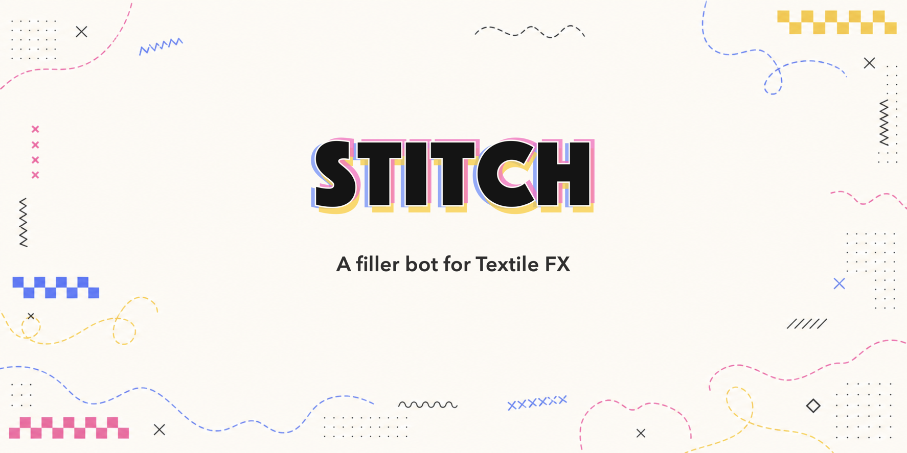

<picture>
  <source media="(prefers-color-scheme: dark)" srcset="assets/stitch-readme-header-dark.png">
  <source media="(prefers-color-scheme: light)" srcset="assets/stitch-readme-header-light.png">
  
</picture>

# Stitch

Stitch is the Textile operator bot for filler-network market making and
settlement closing. It runs as a single binary named `stitch`.

Stitch does two jobs for each configured pool by default:

- **Market making**: keep live buy and sell quotes for a configured
  soft-asset/stablecoin pair.
- **Settlement closing**: close eligible settlement auction positions on-chain
  when the configured margin rules are met.

## Contents

- [Quick Start](#quick-start)
- [Manual Install](#manual-install)
- [How It Works](#how-it-works)
- [Requirements](#requirements)
- [Configuration](#configuration)
- [Running As A Service](#running-as-a-service)
- [Updating](#updating)
- [Stopping and Uninstalling](#stopping-and-uninstalling)
- [Security Notes](#security-notes)

## Quick Start

The recommended way to install Stitch is to have an AI assistant guide the
setup, collect the required operator settings, create the config, run a dry run,
and only start live operation after you confirm.

Use this short prompt to begin:

```text
Help me install and configure Textile Stitch.

Read the full install prompt and follow it in full:
https://raw.githubusercontent.com/textile-protocol/textile-stitch/main/AI_INSTALL_PROMPT.md
If you can't fetch that URL, read AI_INSTALL_PROMPT.md directly from the
textile-protocol/textile-stitch repo (main branch) instead. Don't guess from
other sources.
Use recommended defaults where safe, ask for values with no safe default, protect
STITCH_PRIVATE_KEY, run a dry run first, and do not start live operation until I
confirm.
```

For the full copyable prompt, open [AI_INSTALL_PROMPT.md](AI_INSTALL_PROMPT.md).
For configuration reference, tuning, and troubleshooting, see
[ADVANCED.md](ADVANCED.md).

## Manual Install

Install the latest release:

```bash
curl --proto '=https' --tlsv1.2 -LsSf \
  https://github.com/textile-protocol/textile-stitch/releases/latest/download/stitch-installer.sh | sh
```

Make sure the install directory is on your `PATH`, then check the binary:

```bash
stitch --version
```

Create a config file. On macOS and foreground Linux installs, keep operator
support files in `~/Stitch` so they are easy to find.

```bash
mkdir -p ~/Stitch
chmod 700 ~/Stitch
curl -L -o ~/Stitch/stitch.toml \
  https://raw.githubusercontent.com/textile-protocol/textile-stitch/main/stitch.example.toml
chmod 600 ~/Stitch/stitch.toml
```

Store the operator wallet key in a separate key file. Do not put the private key
in `stitch.toml`.

```bash
printf 'Enter STITCH_PRIVATE_KEY: '
stty -echo
IFS= read -r key
stty echo
printf '\n'
umask 077
printf '%s\n' "$key" > ~/Stitch/stitch.key
unset key
printf 'STITCH_PRIVATE_KEY_FILE=%s\n' "$HOME/Stitch/stitch.key" > ~/Stitch/stitch.env
chmod 600 ~/Stitch/stitch.key ~/Stitch/stitch.env
set -a
. ~/Stitch/stitch.env
set +a
```

Approve Permit2 to pull the tokens Stitch quotes. The operator wallet needs a
one-time approval for each input token (the `debt` token on the buy side, the
`collateral` token on the sell side). Without it, orders post but silently fail
to fill, and a live start refuses to run. Preview what's needed, then approve:

```bash
stitch approve --config ~/Stitch/stitch.toml --dry-run
stitch approve --config ~/Stitch/stitch.toml
```

Maximum is the standard market-maker choice: approve once and never re-approve.
You're approving the canonical Permit2 contract, and the reactor can only pull
against orders you actually signed.

If you'd rather cap the allowance, use `--exact` to approve only the liquidity in
your config:

```bash
stitch approve --config ~/Stitch/stitch.toml --exact
```

Be aware of the trade-off: an exact allowance is consumed as orders fill, so once
it's used up Stitch keeps posting orders that **silently fail to fill** until you
re-approve, and you must re-run `stitch approve` every time you raise your
configured liquidity. Each approval is one gas-paying transaction per token, and
the command is idempotent (it skips tokens already approved).

Run once in dry-run mode before posting live orders:

```bash
stitch --config ~/Stitch/stitch.toml --dry-run
```

Run live:

```bash
stitch --config ~/Stitch/stitch.toml
```

## How It Works

Stitch reads `stitch.toml`, polls your configured price feed, signs UniswapX
limit orders, and posts those signed orders to the Textile indexer. The wallet
private key is read from `STITCH_PRIVATE_KEY_FILE`, or from `STITCH_PRIVATE_KEY`
for compatibility. If both are set, `STITCH_PRIVATE_KEY_FILE` takes precedence.

For market making, each configured pool can have:

- a **buy side**, where Stitch spends the stable/debt asset to buy the
  soft/collateral asset below the feed price;
- a **sell side**, where Stitch spends the soft/collateral asset to sell above
  the feed price.

For settlement closing, Stitch can also discover open positions through a
subgraph and submit `fill()` transactions when a close is profitable under your
configured margin and auction parameters.

Stitch reads the config at startup. After changing `stitch.toml`, restart the
process.

## Requirements

You need:

- an operator wallet private key;
- RPC access for the target chain;
- Textile indexer URL;
- a price feed endpoint returning fresh `{ "price": ..., "timestamp": ... }`;
- the Permit2 and reactor addresses for the target chain;
- funded token balances for the sides you enable;
- Permit2 approvals for the tokens Stitch will spend (set up with
  `stitch approve` — see [Manual Install](#manual-install));
- a small native balance for gas (approvals and, for closing, `fill()` txs);
- a subgraph URL for settlement closing.

## Configuration

Start from [stitch.example.toml](stitch.example.toml). A minimal default pool
configuration looks like this:

```toml
chain_id = 8453
rpc_url = "https://mainnet.base.org"
indexer_url = "https://api.textilecredit.com"
subgraph_url = "https://api.textilecredit.com/subgraph?chainId=8453"
permit2 = "0x000000000022D473030F116dDEE9F6B43aC78BA3"
reactor = "0x0000000000000000000000000000000000000000"
tick_interval_secs = 5

[feed]
url = "https://your-feed.example/cngn-usdc"
staleness_secs = 30

[[pools]]
collateral = "0xcngn0000000000000000000000000000000000c0"
collateral_decimals = 6
debt = "0xusdc0000000000000000000000000000000000d7"
debt_decimals = 6

buy_offset_bps = 10
buy_total_liquidity_debt = "50000000000"
buy_min_slice_debt = "10000000"
buy_max_orders = 40

sell_offset_bps = 10
sell_total_liquidity_collateral = "50000000000"
sell_min_slice_debt = "10000000"
sell_max_orders = 40

ttl_secs = 120
refresh_threshold_bps = 10

closer_pool = "0x0000000000000000000000000000000000000000"
floor_ray = "500000000000000000000000"
buffer_ray = "20000000000000000000000000"
window_secs = 432000
min_margin_collateral = "0"
max_positions_per_fill = 10
discover_first = 200
skip_past_window = true
```

Amounts are atomic token units (e.g. 50,000 of a 6-decimal token is
`50000000000`). The total liquidity fields are targets; if `*_max_orders` is
too low to express the full target with the configured minimum slice, Stitch
leaves the remainder unquoted instead of posting an oversized live book. For
the price-feed orientation, spread options, ladder sizing, and
settlement-closing fields, see the
[configuration reference in ADVANCED.md](ADVANCED.md#configuration-reference).

## Running As A Service

On Linux, run Stitch under systemd so it restarts after crashes and reboots.
System-wide service files use `/etc/stitch-bot`, which keeps service-owned
config separate from foreground operator files in `~/Stitch`.

Create local config, key, and environment files:

```bash
curl -L -o stitch.toml \
  https://raw.githubusercontent.com/textile-protocol/textile-stitch/main/stitch.example.toml

printf 'Enter STITCH_PRIVATE_KEY: '
stty -echo
IFS= read -r key
stty echo
printf '\n'
umask 077
printf '%s\n' "$key" > stitch.key
unset key

cat > stitch.env <<'EOF'
RUST_LOG=info
EOF

curl -L -o stitch.service \
  https://raw.githubusercontent.com/textile-protocol/textile-stitch/main/deploy/stitch.service
```

Install files:

```bash
sudo install -m 0755 "$(command -v stitch)" /usr/local/bin/stitch
sudo mkdir -p /etc/stitch-bot
sudo install -m 0644 stitch.toml /etc/stitch-bot/stitch.toml
sudo install -m 0600 stitch.key /etc/stitch-bot/stitch.key
sudo install -m 0644 stitch.env /etc/stitch-bot/stitch.env
sudo install -m 0644 stitch.service /etc/systemd/system/stitch.service
sudo systemctl daemon-reload
sudo systemctl enable --now stitch
```

The service template uses `LoadCredential` so the private key is injected as a
systemd credential instead of stored in the process environment. Operators who
manage encrypted systemd credentials can replace it with
`LoadCredentialEncrypted`.

Approve Permit2 before the first live start (the service won't run until the
input tokens are approved):

```bash
sudo STITCH_PRIVATE_KEY_FILE=/etc/stitch-bot/stitch.key \
  stitch approve --config /etc/stitch-bot/stitch.toml
```

View logs:

```bash
journalctl -u stitch -f
```

Restart after config changes:

```bash
sudo systemctl restart stitch
```

## Updating

If Stitch was installed from the release installer, update the binary in place:

```bash
stitch --update
```

Then restart the service:

```bash
sudo systemctl restart stitch
```

You can also download a new binary or installer from the latest GitHub Release.

## Stopping and Uninstalling

To stop a foreground run, press `Ctrl-C`. Stitch shuts down cleanly on `Ctrl-C`
or `SIGTERM`, finishing the current tick first, so it never leaves a half-sent
fill or a dangling order.

To stop a background service or uninstall completely, expand your platform:

<details>
<summary><strong>Linux (systemd)</strong></summary>

```bash
# stop
sudo systemctl stop stitch
sudo systemctl disable --now stitch   # also stop it restarting on boot

# uninstall
sudo rm -f /etc/systemd/system/stitch.service
sudo systemctl daemon-reload
sudo rm -f "$(command -v stitch)"     # the installed binary
sudo rm -rf /etc/stitch-bot           # config + env
```

</details>

<details>
<summary><strong>macOS (launchd)</strong></summary>

Use the label you installed the LaunchAgent under (the file in
`~/Library/LaunchAgents/`).

```bash
# stop
launchctl bootout gui/$(id -u)/<label>        # older macOS: launchctl unload ~/Library/LaunchAgents/<label>.plist

# uninstall
rm -f ~/Library/LaunchAgents/<label>.plist
rm -f "$(command -v stitch)"                   # the installed binary
rm -rf ~/Stitch                                # config + env
```

</details>

<details>
<summary><strong>Windows (PowerShell)</strong></summary>

Use the task or service name you created at install time.

```powershell
# stop — Task Scheduler:
schtasks /End /TN "Stitch"
# or, if you installed it as a service with NSSM:
nssm stop Stitch

# uninstall — remove the task or service first:
schtasks /Delete /TN "Stitch" /F                        # Task Scheduler
nssm remove Stitch confirm                              # or the NSSM service
Remove-Item -Force (Get-Command stitch).Source          # the installed binary
Remove-Item -Recurse -Force "$env:USERPROFILE\Stitch"   # config + env
```

</details>

Removing the binary does **not** revoke on-chain Permit2 approvals. If you
approved a maximum allowance, it stays on the operator wallet after uninstall.
To fully wind down, revoke each token's Permit2 approval (set its allowance to
0) or retire the dedicated operator wallet.

## Security Notes

- Keep `STITCH_PRIVATE_KEY` out of `stitch.toml`, shell history, and process
  managers that expose command lines. Prefer `STITCH_PRIVATE_KEY_FILE` pointing
  at a 600-permission key file.
- Use a dedicated operator wallet.
- Fund only the inventory you intend Stitch to use.
- Review token balances, Permit2 approvals, spreads, and order sizes before
  running live. Set approvals with `stitch approve`; prefer a maximum allowance
  unless you have a specific reason to cap it.
- Use `--dry-run` after every config change that affects pricing or sizing.

## License

Stitch is free, open-source software licensed under the **GNU Affero General
Public License v3.0 or later** (`AGPL-3.0-or-later`). Copyright (c) 2026
Textile, Inc.

Copyleft: if you modify Stitch and distribute it — or run a modified version as
a network service — you must release your changes under the same license. See
[`LICENSE`](./LICENSE) for the full text.
